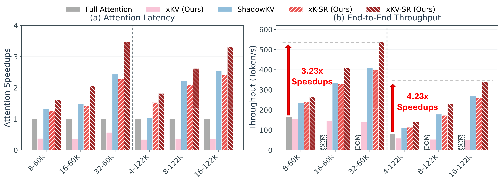

<div align="center">
<h1>
  
  xKV: Cross-Layer KV-Cache Compression via Aligned Singular Vector Extraction
</h1>

Chi-Chih Chang<sup>*1</sup>, 
Wei-Cheng Lin<sup>*2</sup>, 
Chien-Yu Lin<sup>3</sup>, 
Hung-Yueh Chiang<sup>4</sup>, 
Yash Akhauri<sup>1</sup>,<br>
Xilai Dai<sup>1</sup>, 
Huiqiang Jiang<sup>5</sup>, 
Yucheng Li<sup>6</sup>, 
Luis Ceze<sup>3</sup>, 
Kai-Chiang Wu<sup>2</sup>, 
Mohamed S. Abdelfattah<sup>1</sup>

<sup>*</sup>Equal contribution<br>
<sup>1</sup>Cornell University, <sup>2</sup>National Yang Ming Chiao Tung University, <sup>3</sup>University of Washington,<br><sup>4</sup>The University of Texas at Austin, <sup>5</sup>Microsoft Research Asia, <sup>6</sup>University of Surrey<br>
[<a href="https://arxiv.org/abs/2503.18893">Paper</a>] | [<a href="https://abdelfattah-lab.github.io/xKV/">Website</a>]

</div>
<div align="center">

<figcaption>xKV Framework</figcaption>
</div>

## Updates
- [2026.06.15]:🎉 xKV accepted at **ICML 2026**! We release the code of xK-SR and xKV-SR.
- [2025.03.24]:🚀 We release the 1st version of arXiv and code of xKV

## Upcoming Roadmap
- [ ] Release end-to-end system and efficiency evaluation.

## TL;DR
We introduce xKV, a simple yet effective post-training KV-Cache compression method that jointly factorizes grouped-layer KV-Cache into a shared low-rank subspace, leveraging the well-aligned dominant singular vectors across layers. xKV achieves up to **8× KV-Cache compression** while maintaining accuracy on long-context tasks. Combined with Selective Reconstruction (SR) at decode time, **xKV-SR achieves up to 4.23× end-to-end speedup** over standard attention and **30% higher throughput** over strong baselines at similar accuracy.

## Environment Setup
1. Clone the repository (Make sure you have Git installed on your system)
```
git clone https://github.com/abdelfattah-lab/xKV.git
cd xKV
```

2. Prepare environment
To run the code in this project, first, create a Python virtual environment using e.g. uv. To install uv, follow the [UV Installation Guide](https://docs.astral.sh/uv/getting-started/installation/).
```
uv venv --python 3.11 && source .venv/bin/activate && uv pip install --upgrade pip
```
Next, install dependencies
```
git submodule update --init --recursive
uv pip install -r requirements.txt
uv pip install flash-attn==2.7.4.post1 --no-build-isolation
uv pip install -e 3rdparty/MInference --no-build-isolation
cd 3rdparty/MInference
git am ../0001-Change-KIVI-kernel-to-Triton-version.patch
```

Install the optional hadamard transform dependency for better quantization integration,
```
uv pip install -e 3rdparty/fast-hadamard-transform --no-build-isolation # Optional
```

3. Create Datasets (for RULER evaluation)
```
bash scripts/build_datasets.sh
```

## Accuracy Evaluations
We provide an evaluation script `evaluate/eval_acc.py` to measure the accuracy of KV-Cache compression methods. The following methods are supported:

**xKV variants (cross-layer SVD):**
- **Single SVD** — per-layer SVD baseline (`--method xkv --layer_group_size 1`)
- **xKV** — cross-layer SVD with dense reconstruction (`--method xkv --layer_group_size W`)
- **MiniCache** — SLERP-based cross-layer merging (`--method xkv --layer_merge_impl slerp`)

**xKV-SR variants (sparse + selective reconstruction, built on ShadowKV):**
- **xK-SR** — cross-layer SVD on keys only, values offloaded to CPU (`--method xk_sr`)
- **xKV-SR** — cross-layer SVD on both keys and values (`--method xkv_sr`)
- **ShadowKV** — original ShadowKV baseline; equivalent to xK-SR with `--layer_group_size 1` (single-layer SVD on keys)

**Baselines (via [MInference](https://github.com/microsoft/MInference)):**
- StreamingLLM (`--method streamingllm`), SnapKV (`--method snapkv`), PyramidKV (`--method pyramidkv`), KIVI (`--method kivi`), Quest (`--method quest`)

> [!NOTE]
> Full evaluation scripts reproducing all paper results are provided in [`examples/xKV/`](examples/xKV/) and [`examples/xKV_SR/`](examples/xKV_SR/).

### Key Arguments
+ `--model_name_or_path`: Path or HuggingFace name of the model (e.g., `meta-llama/Meta-Llama-3.1-8B-Instruct`).
+ `--dataset_name`: Comma-separated list of datasets (e.g., `ruler/vt,ruler/qa_1,long_bench/qasper`).
+ `--datalen`: Input sequence length in tokens (e.g., `65536`).
+ `--method`: Compression method. xKV pipeline: `xkv`, `streamingllm`, `snapkv`, `pyramidkv`, `kivi`, `quest`. xKV-SR engine: `xk_sr`, `xkv_sr`, `shadowkv`. Omit or use `dense` for full-KV baseline.
+ `--merge_k`, `--merge_v`: Enable SVD compression for keys / values respectively. `--layer_merge_impl`: compression backend [`svd` (default), `slerp` for MiniCache].
+ `--start_layer_idx`, `--end_layer_idx`: Layer range to apply compression (default: all layers; `--end_layer_idx -1` = last layer).
+ `--layer_group_size`: Number of consecutive layers grouped for cross-layer SVD (default: `1`; use `2`/`4` for xKV).
+ `--rank_k`, `--rank_v`: SVD rank per group for keys and values (default: `256` / `768`). Scale proportionally with `--layer_group_size` for iso-compression comparisons.
+ `--sparse_budget`: Sparse token budget for xKV-SR attention (default: `2048`). `--chunk_size`: token chunk granularity for sparse selection (default: `8`).

> [!NOTE]
> When increasing the layer group size, you often need to adjust these ranks for a fair comparison. For instance, if you use `rank_k=128` for `layer_group_size=1`, then to compare performance under `layer_group_size=2`, set `rank_k=256` so that the average rank per layer is similar.

> [!WARNING]
> When evaluating Qwen series, please pass `--flash2` to switch backend to FlashAttention 2. [ref](https://github.com/huggingface/transformers/issues/38002)

### Evaluation on RULER Benchmark
Below we provide example commands for running the RULER benchmark.
#### xKV
Enables xKV compression for all layers (start_layer_idx=0 to end_layer_idx=-1), grouping every 4 layers (layer_group_size=4), using ranks 384 and 576 for each grouped keys and values.
```bash
# xKV-4
python evaluate/eval_acc.py \
    --model_name_or_path meta-llama/Meta-Llama-3.1-8B-Instruct \
    --dataset_name "ruler/vt" --datalen 65536 --flash2 \
    --method xkv --merge_k --merge_v --rank_k 384 --rank_v 576 --layer_group_size 4 --start_layer_idx 0 --end_layer_idx -1
```

#### Single SVD
For evaluation of Single SVD under a similar compression level, use `--layer_group_size 1` with `--rank_k 96 --rank_v 144`.

```bash
# Single SVD (gs=1, rank_k=96, rank_v=144)
python evaluate/eval_acc.py \
    --model_name_or_path meta-llama/Meta-Llama-3.1-8B-Instruct \
    --dataset_name "ruler/vt" --datalen 65536 --flash2 \
    --method xkv --merge_k --merge_v --rank_k 96 --rank_v 144 --layer_group_size 1 --start_layer_idx 0 --end_layer_idx -1
```

#### MiniCache
This command enables the MiniCache approach by specifying `--layer_merge_impl slerp`. The layers 16 through 31 are compressed.
```bash
# MiniCache (slerp, gs=2, layers 16-31)
python evaluate/eval_acc.py \
    --model_name_or_path meta-llama/Meta-Llama-3.1-8B-Instruct \
    --dataset_name "ruler/vt" --datalen 65536 --flash2 \
    --method xkv --merge_k --merge_v --layer_merge_impl slerp --layer_group_size 2 --start_layer_idx 16 --end_layer_idx 31
```

#### ShadowKV / xK-SR / xKV-SR
ShadowKV ([Sun et al., 2024](https://github.com/bytedance/ShadowKV)) uses single-layer SVD on keys with sparse token selection; xK-SR replaces the per-layer SVD with cross-layer SVD. xKV-SR further compresses values on-GPU.
```bash
# ShadowKV baseline (gs=1 ≡ original ShadowKV, rank_k=96, sparse_budget=2048)
python evaluate/eval_acc.py \
    --model_name_or_path meta-llama/Meta-Llama-3.1-8B-Instruct \
    --dataset_name "ruler/vt" --datalen 65536 \
    --method xk_sr --sparse_budget 2048 --chunk_size 8 --layer_group_size 1 --rank_k 96
```

```bash
# xK-SR (gs=4, rank_k=384, sparse_budget=2048)
python evaluate/eval_acc.py \
    --model_name_or_path meta-llama/Meta-Llama-3.1-8B-Instruct \
    --dataset_name "ruler/vt" --datalen 65536 \
    --method xk_sr --sparse_budget 2048 --chunk_size 8 --layer_group_size 4 --rank_k 384
```

```bash
# xKV-SR (gs=4, rank_k=384, rank_v=576, sparse_budget=2048)
python evaluate/eval_acc.py \
    --model_name_or_path meta-llama/Meta-Llama-3.1-8B-Instruct \
    --dataset_name "ruler/vt" --datalen 65536 \
    --method xkv_sr --sparse_budget 2048 --chunk_size 8 --layer_group_size 4 --rank_k 384 --rank_v 576
```

#### Customized Merge Config
We also support customized merge config by providing a yaml file to the `--customized_merge_config` argument. By writing a yaml file you can experiment with different merging groups and different ranks for each group. Please refer to the [configs/example.yaml](configs/example.yaml) for the format.
```bash
# Customized merge config (configs/example.yaml)
python evaluate/eval_acc.py \
    --model_name_or_path meta-llama/Meta-Llama-3.1-8B-Instruct \
    --dataset_name "ruler/niah_single_1" --datalen 65536 --batch_size 1 \
    --method xkv --customized_merge_config configs/example.yaml
```


### Evaluation on DeepSeek Models
DeepSeek’s MLA (multi-latent attention) architecture has two types of hidden states that can be cached during inference:
+ Non-RoPE Latents (the learned, position-agnostic latent vectors).
+ RoPE-based Key States (rotary-positioned keys).
We reuse the Key and Value compression interfaces for these two elements:
+ `--merge_k` and `--rank_k` control compression of the non-RoPE latents (treated like "Keys").
+ `--merge_v` and `--rank_v` control compression of the RoPE-based Key states (treated like "Values").
In our paper, we focus on compressing only the non-RoPE latents only.

#### xKV for DeepSeek (compress only non-RoPE latents)
Enables xKV compression for all layers (start_layer_idx=0 to end_layer_idx=-1), grouping every 4 layers (layer_group_size=4), using ranks 512 for grouped latents.
```bash
# xKV for DeepSeek (gs=4, rank_k=512, non-RoPE latents only)
python evaluate/eval_acc.py \
    --model_name_or_path deepseek-ai/DeepSeek-Coder-V2-Lite-Instruct \
    --dataset_name "long_bench/repobench-p" --datalen 65536 --batch_size 1 --flash2 \
    --method xkv --merge_k --rank_k 512 --layer_group_size 4 --start_layer_idx 0 --end_layer_idx -1
```

## Efficiency
<div align="center">

<figcaption>Throughput and Latency Comparison</figcaption>
</div>

## Efficiency Benchmarks
We provide kernel-level efficiency benchmarks to measure decode attention latency and SVD prefill overhead across different attention methods and sequence lengths.

### Key Arguments
+ `--warmup`: Number of warmup iterations (default: 3).
+ `--iters`: Number of timed iterations (default: 10).
+ `--output_dir`: Directory to save results (default: `results/efficiency/`).

### Build the CUDA kernel (one-time)

Requires CUDA 12.x. The kernel uses [CUTLASS](https://github.com/NVIDIA/cutlass) (fetched via `git submodule update --init 3rdparty/cutlass`).

```bash
bash examples/efficiency/build_kernel.sh
```

### Run benchmarks

```bash
bash examples/efficiency/run_benchmarks.sh
```

Results are saved to `results/efficiency/`. To override defaults:
```bash
CUDA_VISIBLE_DEVICES=1 WARMUP=5 ITERS=20 bash examples/efficiency/run_benchmarks.sh
```

## Citation
If you find xKV useful or relevant to your project and research, please kindly cite our paper:
```bibtex
@article{chang2025xkv,
  title   = {xKV: Cross-Layer {KV}-Cache Compression via Aligned Singular Vector Extraction},
  author  = {Chang, Chi-Chih and Lin, Wei-Cheng and Lin, Chien-Yu and Chiang, Hung-Yueh and Akhauri, Yash and Dai, Xilai and Jiang, Huiqiang and Li, Yucheng and Ceze, Luis and Wu, Kai-Chiang and Abdelfattah, Mohamed S.},
  journal = {arXiv preprint arXiv:2503.18893},
  year    = {2025}
}
```

## Acknowledgement
The xKV-SR inference engine is built upon [ShadowKV](https://github.com/bytedance/ShadowKV). The evaluation framework is adapted from [ShadowKV](https://github.com/bytedance/ShadowKV) and [Palu](https://github.com/shadowpa0327/Palu).